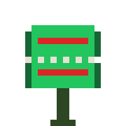

 

# VynJustHumant

**ML Infrastructure Engineer**

Building differentiable image augmentation pipelines. 
Physics-based distortion simulation · PyTorch · Reproducible ML

 

## 🌿 What I Build

**Production-grade PyTorch libraries for computer vision.** Physics-based, differentiable, tested.

| Project | Description | Tech |
|---|---|---|
| [distortion-library](https://github.com/VynJustHumant/distortion-library) | Physics-based image degradation for CV robustness testing | PyTorch, Python |
| Atmospheric Turbulence Blur | Kolmogorov phase screen, chromatic scaling | Differentiable |
| FRC Optical Flow Blur | Video temporal integration, optical-flow FRC | Video + Image |

## 🦴 Tech Stack

## 🌾 GitHub Stats

🌿 Built with physics. Tested with rigor. 🦴

