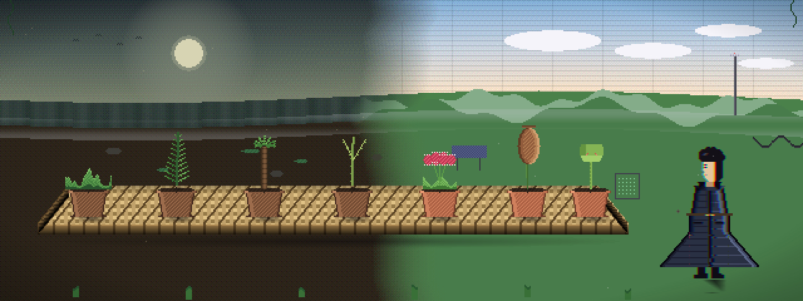

<picture>
  <source media="(prefers-reduced-motion: reduce)" srcset=".github/assets/banner-static.png">
  
</picture>

### ML Infrastructure Engineer

Building differentiable image augmentation pipelines. 
Physics-based distortion simulation · PyTorch · Reproducible ML

 

---

## 🌿 What I Build

**Production-grade PyTorch libraries for computer vision.** 
Physics-based, differentiable, tested.

| Project | Description | Tech |
|---|---|---|
| [distortion-library](https://github.com/VynJustHumant/distortion-library) | Physics-based image degradation for CV robustness | PyTorch |

## 🦴 Tech Stack

🌿 Built with physics. Tested with rigor. 🦴

